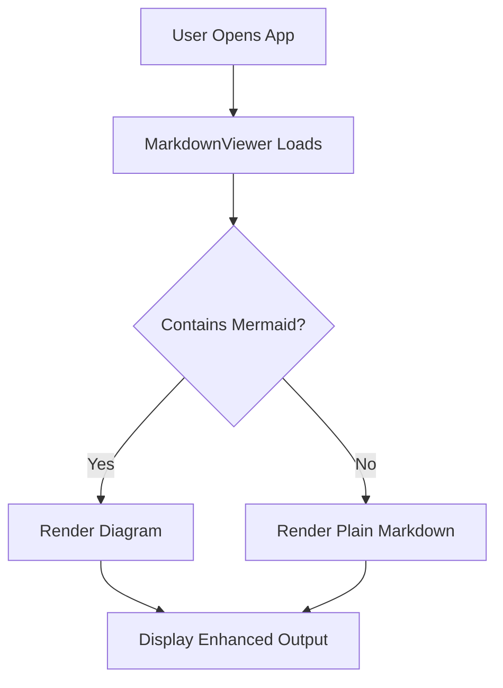

# Mermaid Diagrams

`SfMarkdownViewer` supports rendering Mermaid diagrams embedded in Markdown via the `MermaidBlockTemplate` property. When a fenced code block with ` ```mermaid ` is encountered, the control uses this template instead of the default code block display.

## Required Dependencies

Mermaid rendering requires `SfDiagram`. Add the assembly reference:

- `Syncfusion.SfDiagram.WPF`

And import the namespace in XAML:

```xaml
xmlns:diagram="clr-namespace:Syncfusion.UI.Xaml.Diagram;assembly=Syncfusion.SfDiagram.WPF"
```

---

## MermaidBlockTemplate Property

`MermaidBlockTemplate` accepts a `DataTemplate`. When a `mermaid` code block is found in the Markdown, the control instantiates this template and passes the raw Mermaid text as `DataContext`.

---

## Full Example — Flowchart in Markdown

**XAML:**
```xaml
<Window
    xmlns="http://schemas.microsoft.com/winfx/2006/xaml/presentation"
    xmlns:x="http://schemas.microsoft.com/winfx/2006/xaml"
    xmlns:syncfusion="clr-namespace:Syncfusion.UI.Xaml.Markdown;assembly=Syncfusion.SfMarkdownViewer.WPF"
    xmlns:diagram="clr-namespace:Syncfusion.UI.Xaml.Diagram;assembly=Syncfusion.SfDiagram.WPF"
    xmlns:system="clr-namespace:System;assembly=mscorlib">
    <Grid>
        <syncfusion:SfMarkdownViewer>
            <syncfusion:SfMarkdownViewer.MermaidBlockTemplate>
                <DataTemplate>
                    <diagram:SfDiagram
                        x:Name="mermaidDiagram"
                        Height="600" Width="1000"
                        Focusable="False"
                        Foreground="Black"
                        HorizontalAlignment="Left"
                        HorizontalContentAlignment="Left"
                        Loaded="mermaidDiagram_Loaded" />
                </DataTemplate>
            </syncfusion:SfMarkdownViewer.MermaidBlockTemplate>
            <syncfusion:SfMarkdownViewer.Source>
                <system:String xml:space="preserve">
                    <![CDATA[
# Mermaid Flowchart


                    ]]>
                </system:String>
            </syncfusion:SfMarkdownViewer.Source>
        </syncfusion:SfMarkdownViewer>
    </Grid>
</Window>
```

**C# — Loaded event handler:**
```csharp
using Syncfusion.UI.Xaml.Diagram;
using Syncfusion.UI.Xaml.Diagram.Layout;

private void mermaidDiagram_Loaded(object sender, RoutedEventArgs e)
{
    if (sender is SfDiagram diagram)
    {
        // Disable default page settings for clean rendering
        diagram.PageSettings = null;
        diagram.ScrollSettings.ScrollLimit = ScrollLimit.Limited;

        // Get the Mermaid text from DataContext (set by the viewer)
        var mermaidText = diagram.DataContext as string;

        // Configure flowchart layout
        diagram.LayoutManager = new LayoutManager
        {
            Layout = new FlowchartLayout
            {
                Orientation = FlowchartOrientation.TopToBottom,
                HorizontalSpacing = 80,
                VerticalSpacing = 60,
                Margin = new Thickness(0, 50, 0, 0),
            }
        };

        // Parse and render the Mermaid diagram
        diagram.LoadDiagramFromMermaid(mermaidText);
    }
}
```

---

## FlowchartLayout Options

| Property | Type | Default | Description |
|---|---|---|---|
| `Orientation` | `FlowchartOrientation` | `TopToBottom` | Flow direction: `TopToBottom` or `LeftToRight` |
| `HorizontalSpacing` | `double` | — | Horizontal gap between nodes |
| `VerticalSpacing` | `double` | — | Vertical gap between nodes |
| `Margin` | `Thickness` | — | Margin around the entire diagram |

---

## How It Works

1. `SfMarkdownViewer` parses the Markdown and detects ` ```mermaid ` fenced blocks
2. For each such block, it instantiates the `MermaidBlockTemplate` DataTemplate
3. The raw Mermaid text is passed as `DataContext` to the templated element
4. In the `Loaded` handler, `diagram.DataContext as string` retrieves the Mermaid definition
5. `diagram.LoadDiagramFromMermaid(mermaidText)` renders the diagram

---

## Gotchas

- **`SfDiagram` assembly is required** — without `Syncfusion.SfDiagram.WPF`, the template cannot be created; install the NuGet package `Syncfusion.SfDiagram.WPF`
- **`DataContext` is the raw Mermaid string** — in the `Loaded` handler, always cast `diagram.DataContext as string` to get the Mermaid source text
- **`PageSettings = null` is recommended** — setting it prevents the default page border from interfering with diagram sizing
- **Fixed Width/Height** — set explicit `Width` and `Height` on the `SfDiagram` in the template; auto-sizing may not work correctly for all diagram sizes
- **Only `flowchart` type is shown in docs** — other Mermaid diagram types (sequence, gantt, etc.) may or may not be supported; verify with your Syncfusion version
